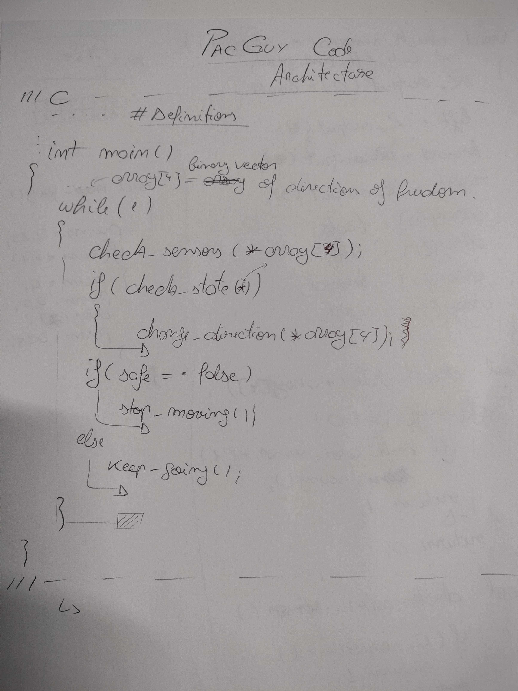

# SPRO3
Basic code functionality: If wall not there, keep going. If there is: we have an array of 3 directions (maybe 4 if we count backwards) and we check which ones are free. if more than one we rand() to get the direction. 
Now, main while loop structure: check sensor data -> check state -> choose direction -> keep moving

First three functions are dependent of one another. That means: After we check the degrees of freedom from the sensor data, we check to see if we are blocked moving forward. if we are we then choose the direction while checking pellet mode (if implemented). Keep moving is outside the previous if cascade, it should always be true, unless otherwise set by check state function (case of no degree of freedom)

